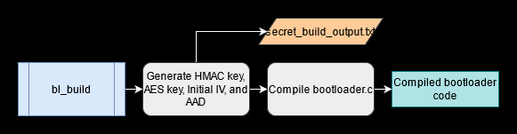
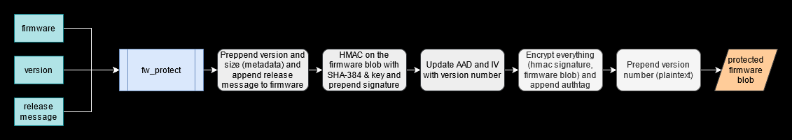
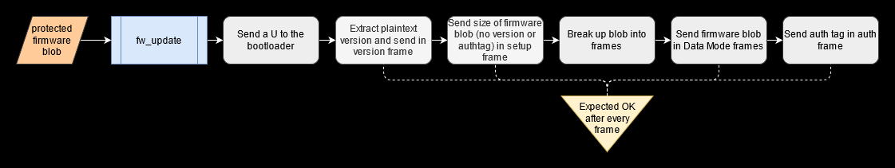
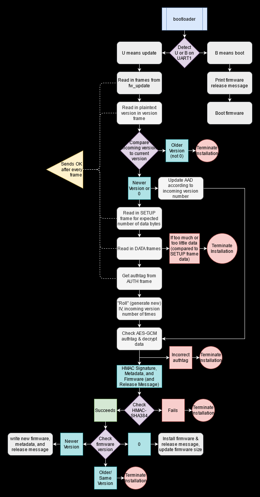
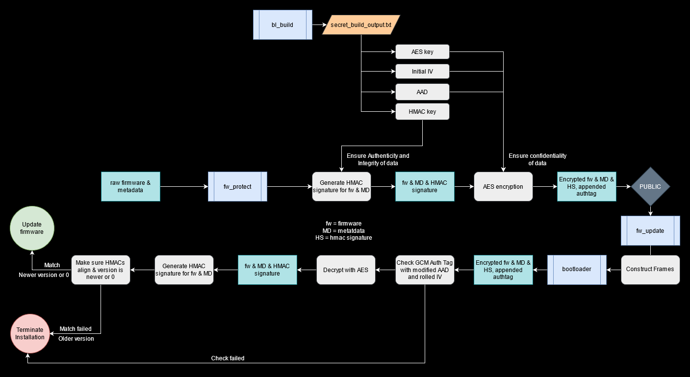
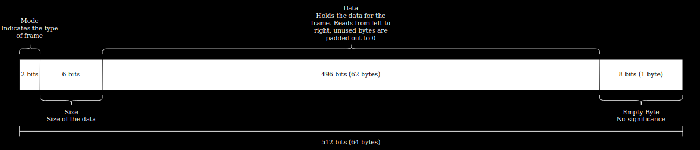

# Embedded Security and Hardware Hacking Design Challenge
Devised and implemented by team Metadata Attached, which comprises Oliver Hendrych, Sakib Pathen, and Kitty Wang, this design is a secure firmware distribution system intended for self-driving cars that incorporates encryption and hashing algorithms, such as AES-128 in GCM mode and HMAC SHA-384.

## Requirements
* C
* Python 3
* BearSSL

## Installation & Execution
1. Install the aforementioned requirements
2. Clone this repository
3. Navigate into the `firmware/firmware` directory of the repository
4. Run the command `make clean`, followed by `make`
5. Navigate out of the firmware directories, and run the following commands within the tools directory

`python bl_build.py`

`python fw_protect.py --infile ../firmware/firmware/gcc/main.bin --outfile ../f_prot.bin --version VERSION --message MESSAGE`

`python tools/bl_emulate.py`

`miniterm /embsec/UART2`

`miniterm /embsec/UART0` and press the spacebar (this sends 0x20), the reset signal

`python tools/fw_update.py --port /embsec/UART1 --firmware ../f_prot.bin`

### bl_build.py

The bl_build tool takes in `bootloader.c`, and compiles it for later operations. In addition, the tool also generates a 48-byte HMAC key, 16-byte AES key, 16-byte IV, and 16-byte AAD. While the AES key, IV, and AAD will be utilized in the the encryption process, the HMAC key will be incoporated into the hashing mechanism. The build tool then writes the keys, IV, and AAD to `secret_build_output.txt`, which is accessible to the bootloader and the relevant host tools.

### fw_protect.py

The firmware protect tool accepts the initial unencrypted firmware, plaintext version number, and release message, and generates an encrypted firmware blob to be used with the fw_update.py tool. After receiving the initial firmware data, the tool prepends the metadata and appends the release message to the raw firmware. The protect tool then generates a 48-byte HMAC signature through the HMAC SHA-384 algorithm. The HMAC SHA-384 algorithm has been applied by `fw_protect.py` as it offers potential protection against DPA and length extension attacks. The data package is then encrypted with the generated keys, IV, and AAD with AES 128 in GCM mode to return a full firmware blob. GCM mode has been employed in this tool considering its capacity to not only maintain the confidentiality of the firmware, but also its integrity and authencity.

### fw_update.py

Following encryption and hash signature generation, the firmware blob outputed by `fw_protect.py` is inputted into the update tool. The firmware update tool constructs 64-byte data frames based on the firmware blob for transmission. During this process, the update tool labels each data frame with one of four modes (versioning, setup, data, auth), as well as six bits indicating the size of the data written in the frame. For more specific details regarding the layout of the data frames, please refer to `fw_update.py`.

### bootloader.c

The bootloader accepts the transmitted data frames from `fw_update.py` as inputs. If "U" is sent to the system, the bootloader begins reading the data frames, and then verifies the integrity and authenticity of the encrypted data with the authentication tag. If the verification is passed, the bootloader then uses the AES key, IV, and AAD to decrypt the firmware blob. Next, the bootloader confirms the validity of the HMAC signature, and if this benchmark is passed, it confirms the state of the version number to prevent potential rollback. Although AES in GCM mode already provides a note of authentication in its returned authentication tag, the HMAC SHA-384 algorithm has been implemented as a second measure of integrity and authenticity. If the bootloader successfully verifies the soundness of the version number, it will begin to write the firmware to flash memory and generate a new IV after modifying the fuse bits.  

## Overview Flow Diagram

## Frame Structure

©2020 The MITRE Corporation. ALL RIGHTS RESERVED. Approved for public release. Distribution unlimited PR_20-00176-9.
